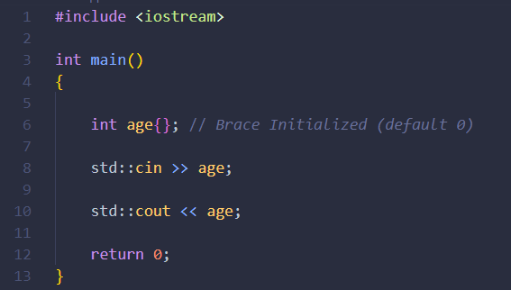

# Introduction
> **This is not a comprehensive guide。**
>
> Topics Covered：[Basic IO operations, Conditionals and Loops, Opertors, Array, Strings, Pointers and Classes]
>
> Prepared By : [Ashish Balsure (22070123030)]

### Section 1: Basic IO Operations
> How to get User Input in C++
>
> 1. istream is used for inputs, to access it use iostream header.
> 2. istream has overloaded the right bit shift operator, so to do inputs right operand of ">>" operator must be an istream object. 
> 3. std::cin >> age (This code will store whatever is entered in input stream to age variable assuming the input entered is appropriate for the type of the variable)
>
> How to print things to output stream
>
> 1. ostream is used for outputs, to access it use iostream header.
> 2. ostream has overloaded the left bit shift operator, so to do outputs right operand of "<<" operator must be an ostream object.
> 3. std::cout << age (This code will print whatever age variable is storing to the output stream)
>
> 
>
> Both the istream and ostream objects return their left operand cin and cout respectively, therefore we can chain together multiple input and output expressions.
> eg. std::cin >> age >> gender >> height
>
### Section 2. 
