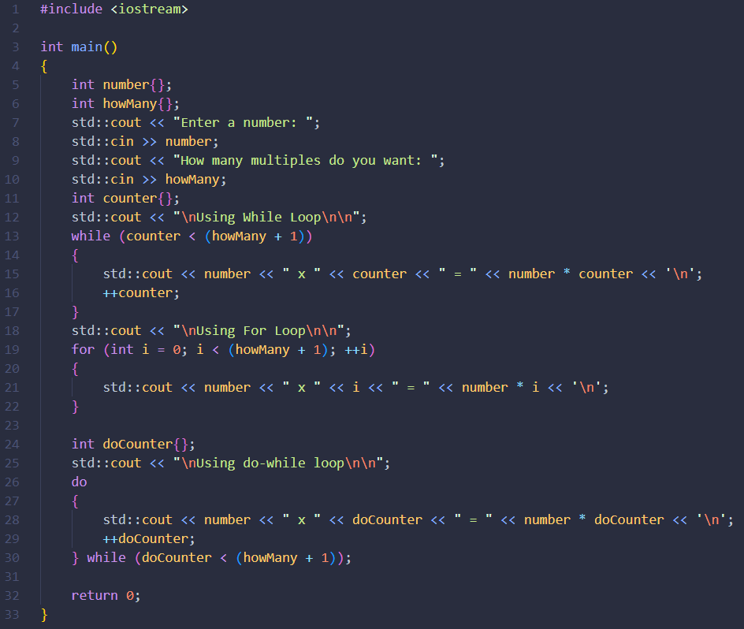
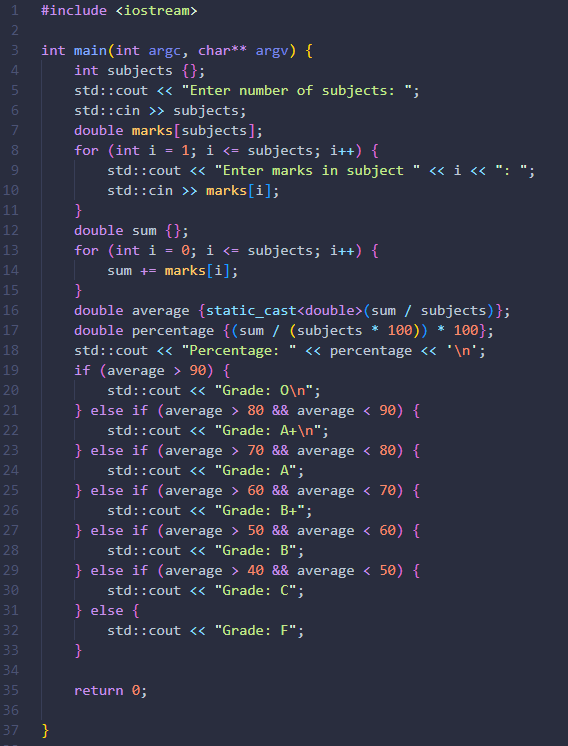

# Before You Read
> **This is not a comprehensive guide。**
>
> Topics Covered：[Basic IO operations, Conditionals and Loops, Opertors, Array, Strings, Pointers and Classes]
>
> Prepared By : [Ashish Balsure (22070123030)]

### Section 1: Basic IO Operations
> How to get User Input in C++
>
> 1. istream is used for inputs, to access it use iostream header.
> 2. istream has overloaded the right bit shift operator, so to do inputs right operand of ">>" operator must be an istream object. 
> 3. std::cin >> age (This code will store whatever is entered in input stream to age variable assuming the input entered is appropriate for the type of the variable)
>
> How to print things to output stream
>
> 1. ostream is used for outputs, to access it use iostream header.
> 2. ostream has overloaded the left bit shift operator, so to do outputs right operand of "<<" operator must be an ostream object.
> 3. std::cout << age (This code will print whatever age variable is storing to the output stream)
>
> 
>
> Both the istream and ostream objects return their left operand cin and cout respectively, therefore we can chain together multiple input and output expressions.
> eg. std::cin >> age >> gender >> height
>
### Section 2: Conditionals and Loops
> Loops
> To run a block of code multiple times, we use a loop.
> c++ offers three types of loops: for, while and do while.
> A simple program that demonstrates the use of all three loops:
>
> 
>
> for loop has three parts to it.
> The first part is used to create a counter variable
> The second part is to test some condition for executing the loop.
> The third part is to increment or decrement the counter variable.
> In contrast while loop contain just the condition part.
> do while are similar to while except that they'll will execute the code block atleast once.
> loops can be nested, although it is generally a good idea to avoid nesting of loop if it is possible to make code more efficient.
>
> Conditionals are statements that allow a block of code to execute based off some condition.
> let say you want some piece of code to execute only on certain scenarios, you can do that using if statements.
> if statment will execute the code in it's block if the conditon evaluates to a true value.
> 
>
> if statements can be couples with two additionals statements called "else if" and "else"
> To test more than one conditions, we can use else if statments and else statments.
> 
